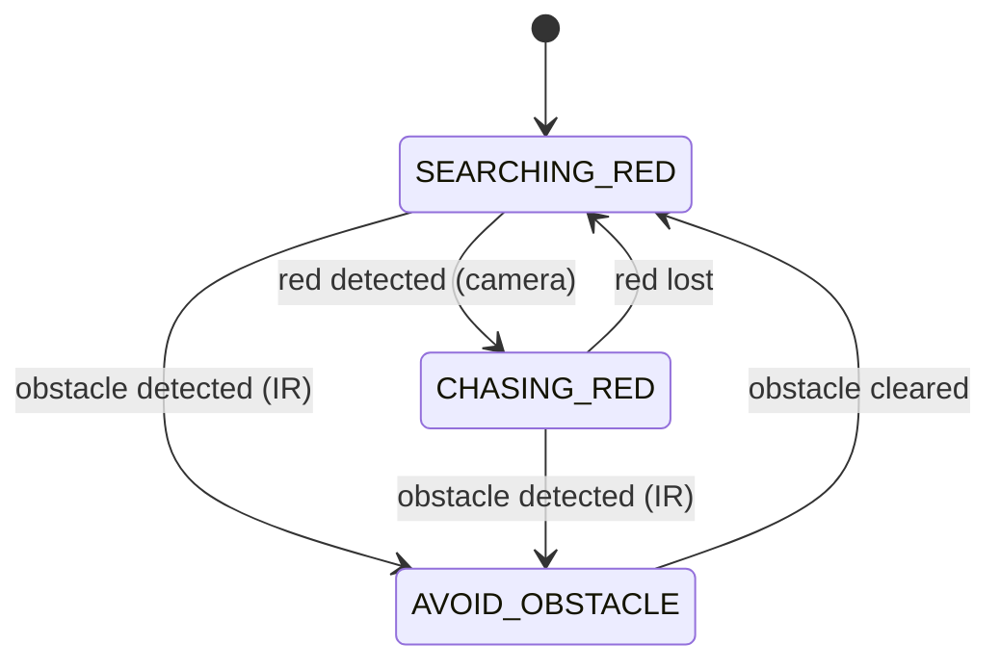
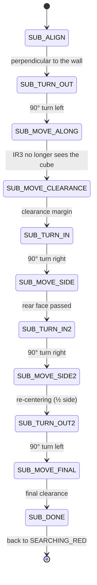

# TORITO


> An **e-puck2** robot turned into a little bull: it hunts for red with its camera, charges at it like a bull at a matador's *muleta*, and steers around obstacles along the way.

<p align="center">
  
</p>

---

## Concept

TORITO roams an arena bounded by dark walls. Its behavior is inspired by a bullfight: the robot sweeps its surroundings looking for the color **red** (the matador's cape). As soon as it spots it, the robot **charges** while keeping a constant distance thanks to a PID controller. If a cubic obstacle stands in its path, TORITO **avoids it automatically** before resuming its search.

The project uses every sensor and actuator on the robot: the two stepper motors, the infrared proximity sensors (obstacle detection), the camera (red detection and distance estimation), and the IMU (gyroscope integration for 90° turns).

## Features

- **Active search** for a red target via a rotating camera sweep.
- **Regulated pursuit** (PID) that controls both distance to and orientation toward the target.
- **Autonomous avoidance** of cubic obstacles with a 6 cm side, driven by a sub-state machine.
- **Continuous obstacle detection**: a new detection during the maneuver interrupts and resets the sequence, so the robot never gets trapped.
- **Gain-based IR normalization**: a single threshold drives all the logic, despite heterogeneous and non-linear sensors.

## Hardware

**e-puck2** robot (GCtronic), STM32F407 microcontroller:

- 2 stepper motors (differential drive)
- PO8030 camera (RGB565 images)
- Inertial measurement unit (IMU) — gyroscope used for turns
- Infrared proximity sensors (8 in total, 3 used: IR1, IR3, IR8)

## Dependencies

The code relies on the official **[`e-puck2_main-processor`](https://github.com/e-puck2/e-puck2_main-processor)** library (the e-puck2 STM32F407 firmware, based on ChibiOS). This repository was developed and tested against commit [`a220d82`](https://github.com/e-puck2/e-puck2_main-processor/tree/a220d827951f09f63bd1016635215ea3b20f40f8).

The library provides the drivers (`motors`, `camera/po8030`, `sensors/proximity`, `sensors/imu`, `camera/dcmi_camera`), the ChibiOS RTOS, and the message bus (`msgbus/messagebus`) used for inter-thread communication.

## Repository structure

```
.
├── main.c                 # Hardware initialization and thread startup
├── main.h                 # Shared declarations (message bus, LED, library includes)
├── robot_management.c     # Main state machine + obstacle-avoidance logic
├── robot_management.h     # States, sub-states, geometric constants, IR gains
├── process_image.c        # Camera capture + processing (red detection, distance, position)
├── process_image.h        # Image-processing constants
├── pid_regulator.c        # PID controller (distance + orientation) for the pursuit
├── pid_regulator.h        # PID gains and thresholds
└── Makefile               # (references the neighboring e-puck2_main-processor library)
```

## Software architecture

### Main state machine

Global coordination is handled by a three-state finite state machine, implemented in the `Robot` thread.



- **`SEARCHING_RED`** — the robot spins in place and scans the camera for red.
- **`CHASING_RED`** — the PID controller takes over the motors to drive toward the target and hold a constant distance.
- **`AVOID_OBSTACLE`** — the robot runs the avoidance sequence (see below).

The current state is published on the `/robot_state` bus topic, letting the `PIDRegulator` and `ProcessImage` threads know which mode the robot is in.

### Threads and priorities

| Thread | File | Rate | Synchronization | Role |
|---|---|---|---|---|
| `main` | `main.c` | — | `chThdSleepMilliseconds(1000)` | Initializes hardware, starts the threads, then sleeps |
| `Robot` | `robot_management.c` | 100 Hz | `messagebus_topic_wait(/proximity)` | State machine; drives the motors in `SEARCHING_RED` and `AVOID_OBSTACLE`; reads IR + IMU |
| `PIDRegulator` | `pid_regulator.c` | 100 Hz | `chThdSleepUntilWindowed()` | PID control; drives the motors in `CHASING_RED` |
| `CaptureImage` | `process_image.c` | camera rate | `wait_image_ready()` | Image capture (one-shot mode) |
| `ProcessImage` | `process_image.c` | camera rate | `chBSemWait(image_ready_sem)` | Red extraction, width → distance, target position |

All threads share the same priority (`NORMALPRIO`). This is deliberate: although `Robot` and `PIDRegulator` both command the motors, they **never do so at the same time** (one in `SEARCHING`/`AVOID`, the other in `CHASING`). `ProcessImage`/`CaptureImage` only use the camera, and the IMU + IR sensors are handled solely by `Robot`. Since the threads never access the same resources simultaneously, no conflict warrants a priority hierarchy.

### Message bus (topics)

- `/robot_state` — published by `Robot`, read by `PIDRegulator` and `ProcessImage`.
- `/proximity` — provided by the library (IR sensors, 100 Hz), paces the `Robot` thread.
- `/imu` — provided by the library (IMU, 250 Hz, downsampled to 100 Hz).

## Target detection (image processing)

The processing reuses the capture and edge-detection architecture from Lab 4 (TP4), heavily reworked for the arena:

- **Specialized on red.** The red channel is isolated directly from the RGB565 format via the binary mask `& 0xF8`, which removes any needless computation on the green and blue channels.
- **Rising-edge detection.** Unlike the lab (dark line on a light background), the algorithm here looks for a **bright** object (the red target) standing out against the darker arena background.
- **False-positive filtering.** The mean red intensity (`red_mean`) is computed: the target is only validated if the object is geometrically consistent (width ≥ `MIN_LINE_WIDTH`) **and** its intensity exceeds `RED_PIXEL_INTENSITY_THRESHOLD`.

The camera therefore does double duty: the **width** of the red band gives the distance (`distance_mm = PXTOMM / width`), and its **horizontal position** is used to re-center the target through the PID. The result (`red_detected_check`) is exposed to the `Robot` thread to validate the state-machine transitions.

## Obstacle avoidance

The maneuver is designed for cubic obstacles with a 6 cm side. It triggers when IR1 **or** IR8 (front sensors) measures a distance ≤ 1 cm. The robot then runs a sub-state machine that goes around the cube in four phases:

1. **Alignment and first turn** — the robot aligns perpendicular to the wall, turns 90° left, then follows the cube until its right-side sensor (IR3) no longer detects it.
2. **Lateral clearance** — it keeps going straight for a safety margin, then turns 90° right.
3. **Passing the rear face** — it moves more than 6 cm to clear the full width of the cube, then makes another 90° right turn.
4. **Return to axis and final clearance** — it advances by half a cube width to re-center, turns 90° left one last time to recover its original heading, and finally moves away from the obstacle.



The 90° turns do not rely on the stepper motors but on **gyroscope integration** (`total_rotation += |gyro_z| × GYRO_INTEGRATION_TIME`), which is more robust against wheel slip.

**Continuous detection:** at any moment during the maneuver, if the front sensors detect a new obstacle, the sequence is immediately interrupted and reset to `SUB_ALIGN`. The robot can therefore never get trapped in its own avoidance path.

## Infrared sensors

Only three sensors turned out to be necessary. Because their raw output (`get_calibrated_prox()`) is non-linear and heterogeneous from one sensor to another, we apply a **gain-based normalization** (`get_norm_prox()`) rather than converting to a physical distance. Each gain is calibrated so that a normalized value of **100** corresponds exactly to the sensor's critical transition distance.

| Sensor | `get_norm_prox()` index | Position | Distance at value 100 | Gain | Role |
|---|---|---|---|---|---|
| IR1 | 0 | Front right | 1 cm | 100 / 245 ≈ 0.408 | Front obstacle detection |
| IR3 | 2 | Right side | 2 cm | 100 / 120 ≈ 0.833 | Wall-following during avoidance |
| IR8 | 7 | Front left | 1 cm | 100 / 550 ≈ 0.182 | Front obstacle detection |

Thanks to this harmonization, all the logic relies on a **single threshold**: `PROX_THRESHOLD_DETECTION = 100.0f`. This makes the state machine easier to read and the behavior more robust against sensor-to-sensor variation.

## PID controller

Active only in the `CHASING_RED` state, the controller regulates the distance to the target (measured from the width of the red band) and corrects the orientation (from the target's horizontal position in the image). The integral and derivative errors are **reset on every state change** to avoid any trailing effect.

| Constant | Value | Role |
|---|---|---|
| `KP` | 45.0 | Proportional gain (distance) |
| `KI` | 0.1 | Integral gain (distance) |
| `KD` | 0.4 | Derivative gain (distance) |
| `GOAL_DISTANCE` | 70 mm | Target following distance |
| `ROTATION_COEFF` | 1.2 | Orientation-correction gain |
| `ERROR_THRESHOLD` | 1.0 mm | Dead zone (camera noise) |

The error sum is bounded (`MAX_SUM_ERROR`) to prevent integral wind-up.

## Sampling and synchronization

The rates are aligned with the hardware to avoid wasting resources:

- **`Robot` (100 Hz)** — although the IMU can deliver 250 Hz, the IR sensors have a fixed 100 Hz cycle. We align on the slowest sensor to avoid reading the same distance values multiple times.
- **`PIDRegulator` (100 Hz)** — since the camera has a variable capture period (38 to 76 ms depending on lighting), it cannot be synchronized directly. 100 Hz is a good compromise: minimal wait before a new image, without wasting the processor. Lowering this rate would degrade responsiveness and distort the integral gain (slower error accumulation).

## Build and flash

The project follows the standard e-puck2 development toolchain. In short:

1. Install the e-puck2 development environment (ARM GCC toolchain + ChibiOS) — see the [GCtronic documentation](https://www.gctronic.com/doc/index.php/e-puck2_robot_side_development).
2. Clone the library **next to** this repository, so the `Makefile` can find it:
   ```bash
   git clone --recursive https://github.com/e-puck2/e-puck2_main-processor.git
   ```
   Expected layout:
   ```
   e-puck2_main-processor/
   torito/            ← this repository
   ```
3. Build:
   ```bash
   make
   ```
   The binary is generated in `build/`.
4. Flash the STM32F407 through the robot's built-in programmer/debugger (USB connection), from Eclipse or via the embedded gdb server.

> The exact commands depend on the course's toolchain setup; refer to the [official documentation](https://www.gctronic.com/doc/index.php/e-puck2_robot_side_development) if in doubt.

## Authors

- **Bouilhol Baptiste** (379847)
- **Brognart Colombe** (380082)

Embedded systems project — **MICRO-315** course, EPFL, May 2026.
